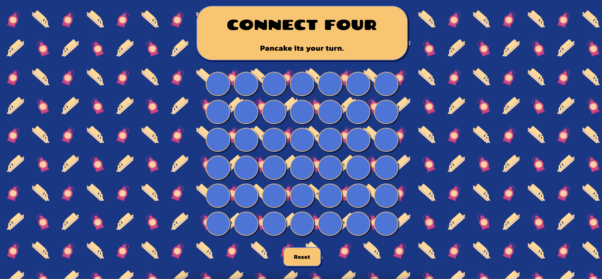

# Connect Four!

With a personal spin being inspired by one GA Bootcamps MORNING ATTENDANCE QUESTIONs: Pancakes or waffles? Connect Four is a two-player connection board game, in which the players choose a color and then take turns dropping colored tokens into a seven-column, six-row vertically suspended grid. The player tokens were chosen with this breakfast theme in mind. The pieces fall straight down, occupying the lowest available space within the column. The objective of the game is to be the first to form a horizontal, vertical, or diagonal line of four of one's own tokens. Connect Four is a solved game. The first player can always win by playing the right moves. The overall design was done with a high contrast color template to incorporate minimal accessibility features allowing for this theme of the traditional connect four to evolve over time as well as a playful syrup and butter background to round out the styling of the game. Enjoy! 

## [Play the game here](https://connectfour-unit1project-jrobinson.netlify.app/)

## Technologies used 👨‍💻

- CSS
- JavaScript
- HTML
- git

## [Planning Doc](https://docs.google.com/document/d/1-Gs42W7Ls-A1QS3JFA3NVNXFPTjL007KFdtw0VrpOtY/edit?usp=sharing)🗒️

## Credits 🙏

## Attributions

While the below disclaimers are technically required by their license-holders I would like to also sincerely thank all the creators whose work makes this site look great. Thank you!

Connect four uses the google font families of "Chango' and "Kanit".
- 'Chango', cursive; @400
- 'Kanit', sans-serif; @700

The Icons were provided as follows:

Pancake: 
<a href="https://www.flaticon.com/free-icons/pancake" title="pancake icons">Pancake icons created by Darius Dan - Flaticon</a>
Waffle: 
<a href="https://www.flaticon.com/free-icons/waffle" title="waffle icons">Waffle icons created by Flat Icons - Flaticon</a>
Butter: 
<a href="https://www.flaticon.com/free-icons/butter" title="Butter icons">Butter icons created by Freepik - Flaticon</a>
Syrup: 
<a href="https://www.flaticon.com/free-icons/syrup" title="syrup icons">Syrup icons created by Smashicons - Flaticon</a>

## Recent Changes 👏

- Rework the icon placement to allow for a spin function on the hover.
- Delete redundant css.
- Optimize display: flex; for overall layout and responsiveness.
- Delete redundant javascript.

## Ice Box 🍧

- [ ] Apply more responsive features: fix background image when it is smaller | increase board size for  viewer on a phone.
- [x] add spin to icon on pointer hover
- [ ] Dark Mode
- [ ] Confetti!
- [ ] Add bounce to player icons
- [ ] Add drop to player icons
- [x] Sound